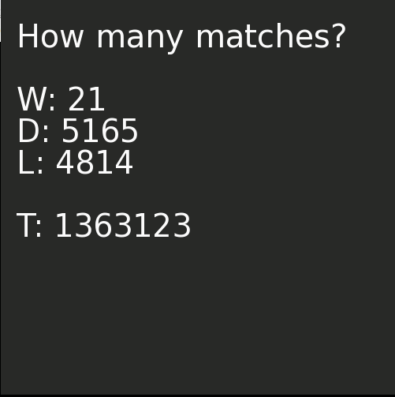
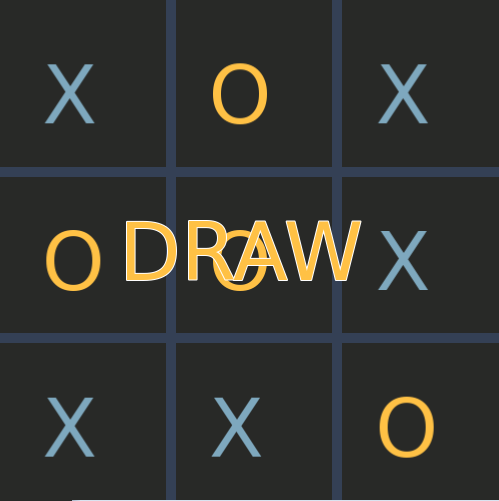

# ML-Tic-Tac-Toe

<h1> Description </h1>
  
 A machine learning algorithm that learns to play tic tac toe, with no knowledge about rules or strategies, wrapped inside a SFML game for an interactive user interface. After the user lets the algorithm learn by itself for X number of games, the user can match agains the algorithm to see its progress. 

<h1> Preview </h1>
<h2> Teaching the alhorithm </h2>

<h2> Playing agains the algorithm </h2>

<h1> Author </h1>

Lorin Budaca lorinbudaca@gmail.com

